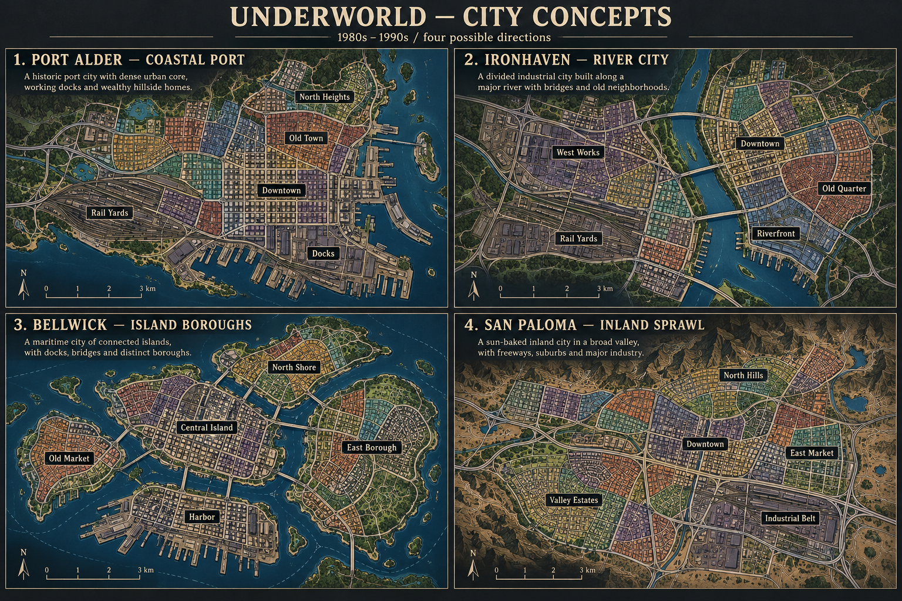

# City concepts for v0.2.0

Setting: a fictional city inspired by the late 1980s and early 1990s. These are
original visual directions for discussion. **Selected: Iron Haven.** Its first
playable 24-district river map is documented in [IRON_HAVEN.md](IRON_HAVEN.md).
The spelling now follows the selected name, Iron Haven.

| Option | City and character | Strategic possibilities | Implementation scope |
| --- | --- | --- | --- |
| 1 | **Port Alder — coastal port.** A compact older downtown, working docks, rail yards, and wealthy northern hills. Baltimore/Philadelphia atmosphere. | A readable core with a distinct industrial waterfront and room for later expansion into hillside neighborhoods. | Best first step: compact geography and simple district connections. |
| 2 | **Iron Haven — river city (selected).** Older brick neighborhoods and industry divided by a river. Pittsburgh/Cleveland atmosphere. | Bridges create a few important connections between competing sides of the city. | Implemented as 24 districts with two cross-bank connections. |
| 3 | **Bellwick — island boroughs.** A dense central island, outer residential boroughs, markets, and a working harbor. New York atmosphere. | Each borough can support its own faction identity; crossings connect several local struggles into one city. | More connections to author and more care needed to keep the map readable. |
| 4 | **San Paloma — inland sprawl.** A valley city with freeways, industrial belts, older downtown blocks, suburbs, and hills. Southern California atmosphere. | Several commercial centers encourage a wider, less centralized territorial game. | A larger map; travel and distance could become useful later systems. |

Iron Haven was selected for its industrial character and geographic choke points.

The concept art illustrates geography and neighborhood character. Neighborhood
colors in this sheet are design accents, not current faction ownership. Details
such as neighborhood-specific income, travel, and regional police behavior would
need actual game rules before being playable features. Iron Haven's bridge
connections now constrain player and rival expansion in the simulation.

The implemented district list, starting businesses, and bridge connections are
recorded in [IRON_HAVEN.md](IRON_HAVEN.md). Rendering and simulation share a fixed
layout definition so the visible crossings match the actual claim rules.
