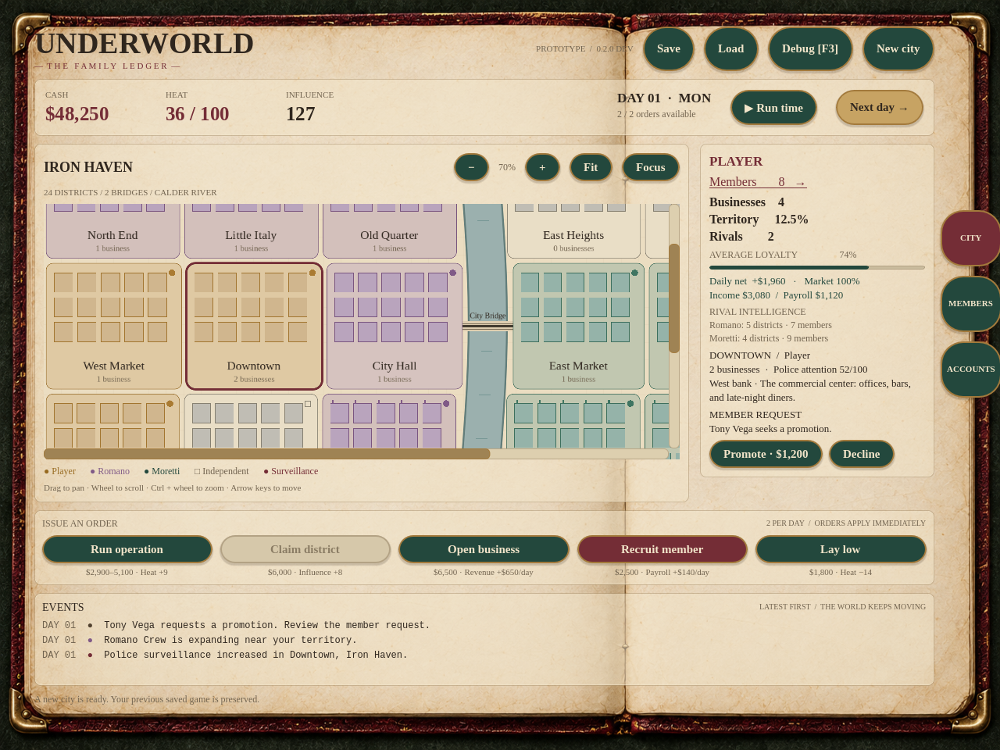
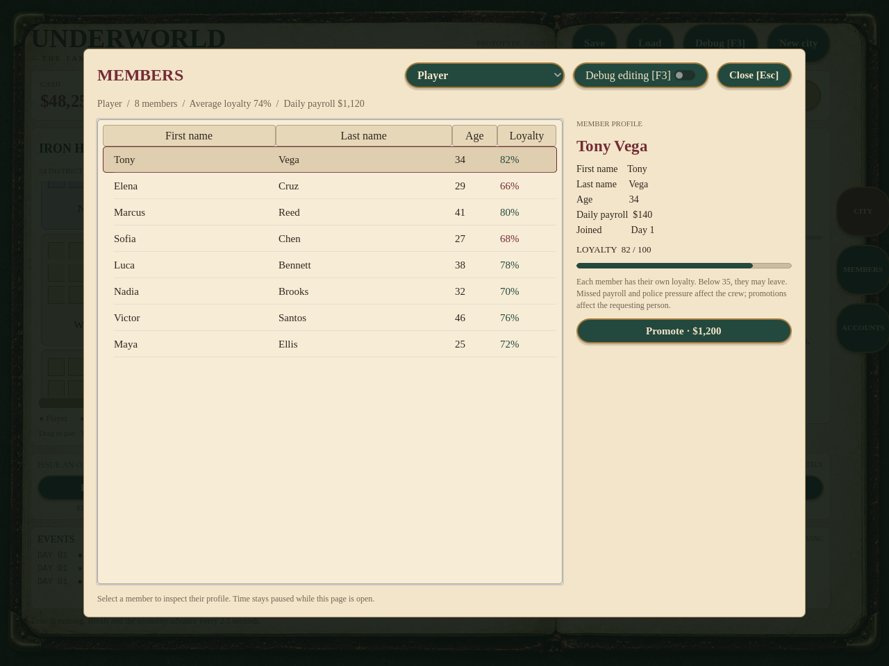

# The Family Ledger

The v0.2.0 development UI uses a 1950s mafia back-office look: warm ivory paper,
oxblood leather, antique brass borders, forest-green and burgundy capsule
buttons, serif headings, and a typewritten event log. All gameplay text, buttons,
stats, and map districts are live Godot controls and drawing. The generated
ledger background contains no baked-in game information.

## A map that moves independently

Iron Haven is a 1600 × 1000 city canvas inside a clipped map viewport. The
organization ledger, actions, and events remain in place while the map moves.
The map opens at 70% scale around Downtown. It retains the existing 24 districts,
two bridges, and save compatibility with the original prototype city.

| Control | Behavior |
| --- | --- |
| Click a district | Select and inspect it |
| Left, middle, or right drag | Pan without changing district selection |
| Wheel | Scroll vertically |
| Shift + wheel | Scroll horizontally |
| Ctrl + wheel | Zoom around the cursor |
| − / + toolbar buttons | Zoom around the view center |
| Fit / Home | Show the whole map |
| Focus / F | Bring the selected district into view |
| Arrow keys | Pan while the map has keyboard focus |
| Scrollbars | Move along either axis |

Zoom ranges from 25% to 160%; scrolling stays inside the canvas. Edge districts
are brought into view without scrolling beyond map bounds. Opening Members or
Debug blocks map interactions. Viewing changes never spend an order or advance
simulation RNG.

Notebook tabs provide City, Members, and Accounts navigation. Accounts shows the
current budget and pauses time. Members provides the existing individual roster
and profile editor in the same paper-and-ink theme.

## Operations and businesses

Operation payout is **$1,900–$4,100 + $500 × local business count**. The random
base roll, +9 heat, +12 local police attention, and one-order cost stay the same.
The bonus uses businesses in the selected district, not the whole organization.
All factions use this rule.

| Businesses in the district | Operation payout |
| --- | --- |
| 0 | $1,900–$4,100 |
| 1 | $2,400–$4,600 |
| 2 | $2,900–$5,100 |
| 3 | $3,400–$5,600 |

The button's payout quote and tooltip update when selection or business count
changes. Operation events report the local count and bonus. Daily business
income remains a separate system at $650 base per business, adjusted by market
demand.

The game remains v0.2.0-dev; this update does not create a release tag. Assets
and bundled font licensing are documented in [the asset attribution](../game/assets/ATTRIBUTION.md).

## Approved mobile direction

The [mobile concept art](concepts/README.md) preserves the approved portrait City,
Ledger, and Members layouts for future implementation.

The [approved pixel Family Ledger concept](concepts/README.md#pixel-family-ledger)
explores bitmap lettering, pixel portraits, and shaped notebook controls for the
Crew, Profile, and Assignments flow. Its skills and assignments are design
proposals for future implementation.

All [pixel palette variants](concepts/README.md#approved-pixel-palettes) are
approved as concept art. **02 Tobacco & Teal** is the selected main-game design
direction; the other palettes are retained for potential customization or
class-specific presentation. These decisions do not change the current runtime
theme. See [mobile-first requirements](MOBILE_FIRST.md) for the proposed next
implementation priorities.
