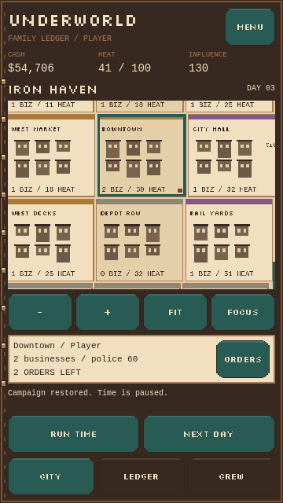
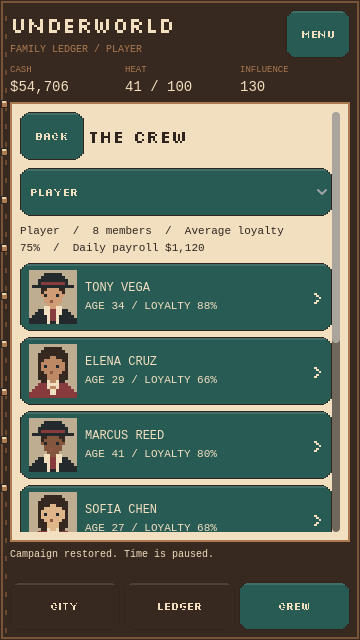

# Playable pixel phone prototype

The default game scene is now `game/ui/mobile.tscn`, using the approved **02
Tobacco & Teal** palette, bitmap headings, reusable stepped buttons, pixel
portraits, a notebook binding, and a schematic pixel city. It shares the current
world rules with the earlier desktop interface, retained in `game/ui/main.tscn`.

## Navigation and gameplay

- **City:** tap to select, one finger to pan, two fingers to pinch, or use the
  visible zoom/Fit/Focus controls. **Orders** opens the selected district's
  scrollable inspection and action sheet. Requirements and consequences are
  visible next to each action; no hover or keyboard is required.
- **Ledger:** organization totals, loyalty, daily budget, rival rosters,
  promotion requests, and the complete recent event feed.
- **Crew:** player or rival roster, named member profiles, age, loyalty,
  promotion decisions, and optional profile debug editing.
- **Menu:** Save, Load, New city, Exit, gameplay help, and the complete scrolling
  simulation debugger, including rival scenarios and fast-forward controls.

All existing orders, local-business operation bonuses, territorial bridge
rules, rival recruitment/losses, and member loyalty remain in the shared world
simulation. Skills, assignments, ranks, and classes have not been introduced.

## Touch and lifecycle

Primary buttons have at least 48 logical UI units of height. The portrait layout
reflows for taller screens and tablets; mobile safe areas adjust the outer
margins. When the keyboard opens, secondary footer controls are hidden and the
focused editor field is brought into its scroll view.

Map gestures only inspect or navigate. Dragging, pinching, and cancelled touches
cannot turn into a district tap on release. Emulated mouse events are ignored by
the map to avoid processing a touch twice. Sheets and pages pause automatic
time, and repeated immediate day taps are debounced.

Android Back closes the current sheet or returns from profile to roster, then
to City. From City it opens the Menu, where Exit saves and closes the game.

The full campaign and RNG state autosave after confirmed mutations and settled
days, including debug edits. Saves are flushed to a temporary file and replaced;
a validated prior save becomes the recovery backup. Loading can recover from a
corrupt or missing primary without copying corruption over a valid backup.
Older save migrations are retained.

Backgrounding pauses automatic time, cancels gestures, stops the safe-area
poller, and attempts a save. Resuming remains paused. Restart restores the world,
selected district, page, and selected profile. The simulation does not advance
while the app is closed. New city explicitly replaces and autosaves the campaign
after confirmation.

## Build and check

See [the Android download and build instructions](../builds/README.md). The APK
targets ARM64 Android 7.0 and newer; the separate emulator preset targets x86_64.
No account, server, analytics SDK, or network permission is required.

The preview caps rendering at 30 FPS and uses low Compatibility renderer light
limits appropriate for a 2D interface. Simulation time remains independent of
frame rate. Startup uses the notebook's cover color rather than an engine logo.

Run `tests/mobile_tests.gd` for touch dispatch to all 24 districts, drag/pinch
separation, screen bounds, order/day autosaves, promotion, rival debugging,
background/resume, process restart, and corrupted-save backup recovery. Earlier
desktop tests explicitly choose their own viewport size so both interfaces
remain testable.

The cloud can render the UI and build signed Android packages. Physical-device battery,
performance, safe-area, and keyboard checks remain part of release validation.
iOS export and signing require a separate macOS/Xcode workflow. The cloud's
software-only Android emulator installed the x86_64 counterpart, but recurring
Android system-process hangs prevented a full device playthrough. This preview
still needs a physical-phone check; it is not a verified store release.
