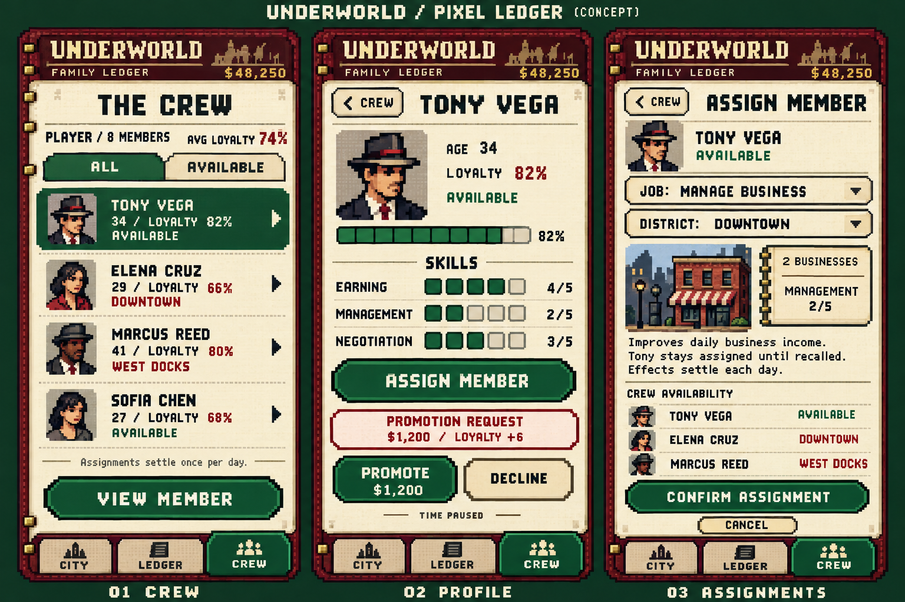

# Approved concept art

## Family Ledger mobile layouts

The Family Ledger mobile direction is approved as concept art for future design.
It carries the ivory paper, oxblood leather, forest green, burgundy, brass, and
rounded controls into portrait layouts with bottom notebook tabs.

- **City:** touch map with drag and pinch navigation, plus a fixed district sheet
  for inspection and orders.
- **Ledger:** finances, district selection, daily orders, and a separate Next day
  control.
- **Members:** crew selection, individual profiles, loyalty, and promotion
  decisions while time is paused.

This sheet records the approved visual and interaction direction. The map art is
illustrative; implemented district names, connections, and ownership are defined
by `game/simulation/city_layout.gd` and the world state. Mobile implementation is
a future task.

## Pixel Family Ledger

The pixel-art Family Ledger direction is approved as concept art. It keeps the
ivory paper, burgundy leather, forest-green accents, notebook tabs, and shaped
buttons, with bitmap lettering and small reusable character portraits.

The member flow runs from **Crew** to **Profile** to **Assignments**:

- **Crew:** browse names, ages, loyalty, and availability.
- **Profile:** inspect a member and review a promotion request.
- **Assignments:** choose a job and district, then confirm the assignment.

Skills (Earning, Management, and Negotiation) and job assignments are proposed
mechanics shown for design exploration. They are not implemented in the game.
This image records the approved visual direction rather than a game screenshot.
