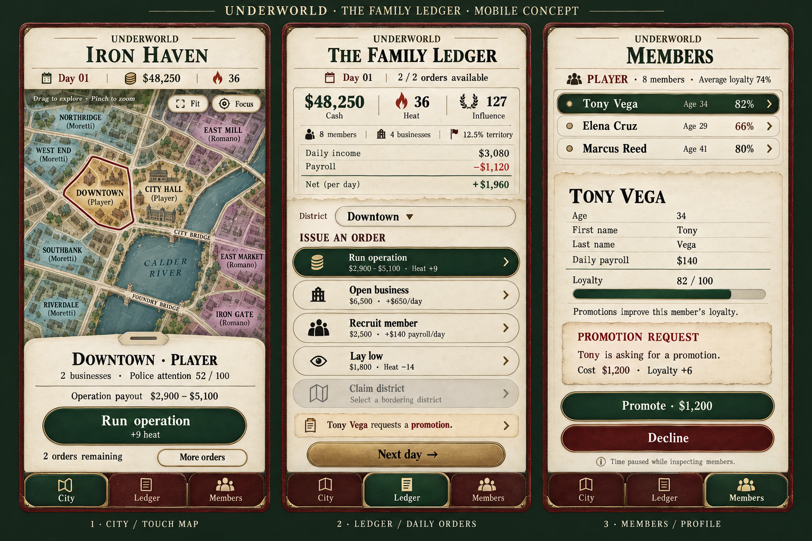

# Approved mobile concept art

The Family Ledger mobile direction is approved as concept art for future design.
It carries the ivory paper, oxblood leather, forest green, burgundy, brass, and
rounded controls into portrait layouts with bottom notebook tabs.

- **City:** touch map with drag and pinch navigation, plus a fixed district sheet
  for inspection and orders.
- **Ledger:** finances, district selection, daily orders, and a separate Next day
  control.
- **Members:** crew selection, individual profiles, loyalty, and promotion
  decisions while time is paused.

This sheet records the approved visual and interaction direction. The map art is
illustrative; implemented district names, connections, and ownership are defined
by `game/simulation/city_layout.gd` and the world state. Mobile implementation is
a future task.
